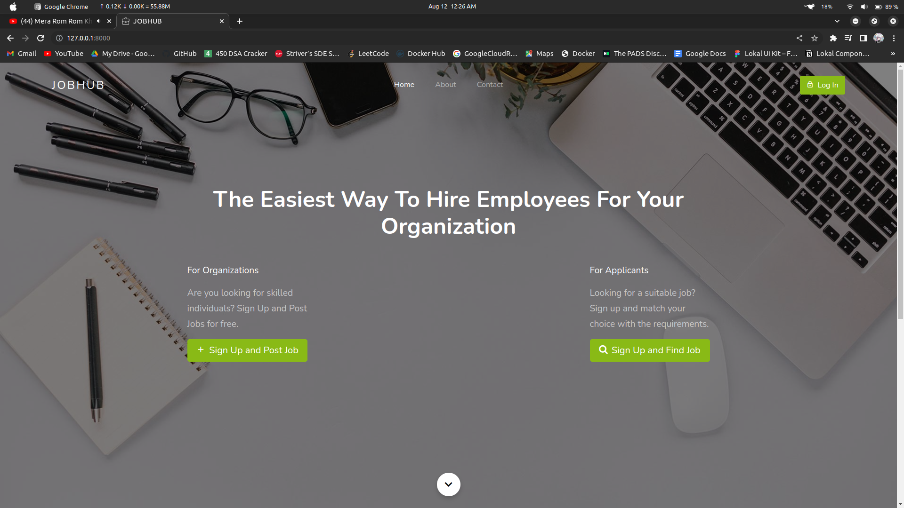
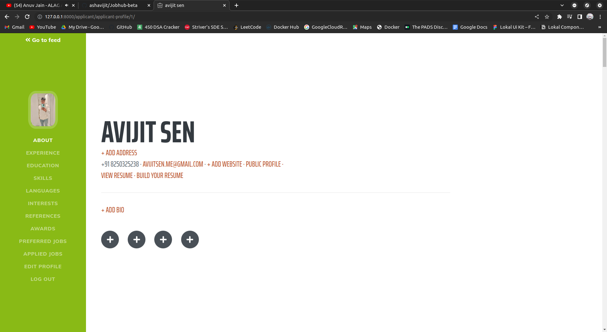
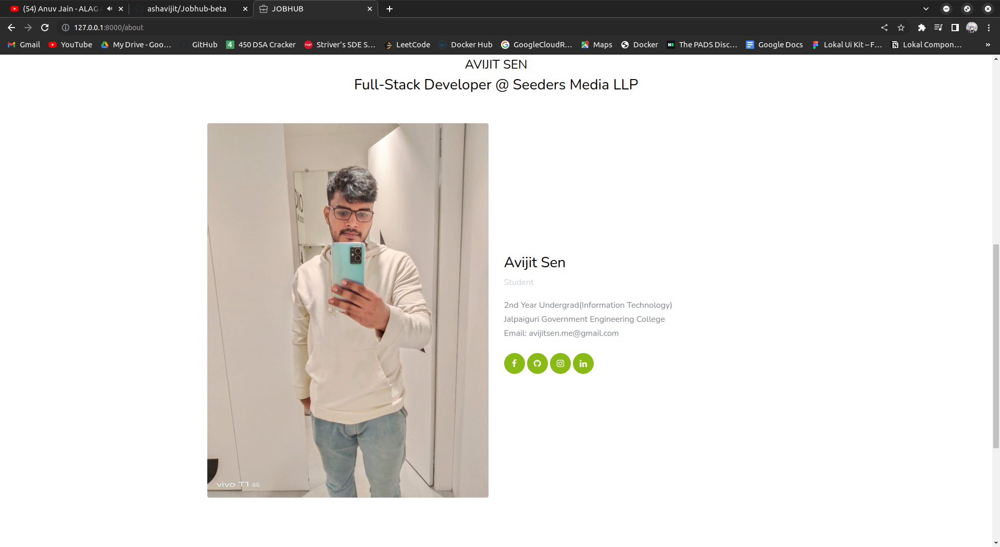
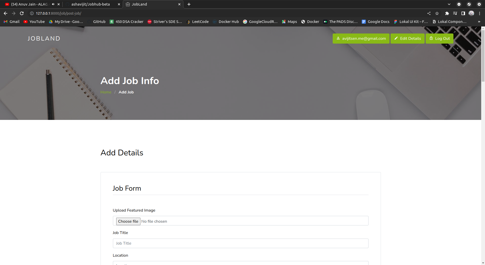

# JobHub

# Introduction

The goal of this project is to provide minimalistic django Job searcher platform template that everyone can use, which _just works_ out of the box and has the basic setup you can expand on. 

Template is written with django 4.05 and python 3.10 in mind.

### Main features

* Separated dev and production settings

* Example app with custom user model

* Bootstrap static files included

* User registration and logging in as demo

* Procfile for easy deployments

* Separated requirements files

* SQLite by default if no env variable is set

# Usage

To use this template to start your own project:

### Existing virtualenv

If your project is already in an existing python3 virtualenv first install django by running

    $ pip install django

 Check `django --version` to see if it worked.

And then run the `django-admin.py` command to start the new project:

    $ django-admin.py startproject \
      --template=https://github.com/ashavijit/Jobhub-beta \
      --extension=py,md \
      <project_name>
      
### No virtualenv

This assumes that `python3` is linked to valid installation of python 3 and that `pip` is installed and `pip3`is valid
for installing python 3 packages.

Installing inside virtualenv is recommended, however you can start your project without virtualenv too.

If you don't have django installed for python 3 then run:

    $ pip3 install django
    
And then:

    $ python3 -m django startproject \
      --template=https://github.com/ashavijit/Jobhub-beta/ \
      
      
      
After that just install the local dependencies, run migrations, and start the server.

# JobHub

# Getting Started

First clone the repository from Github and switch to the new directory:

    $ git clone https://github.com/ashavijit/Jobhub-beta
    $ cd jobhub-beta
    
Activate the virtualenv for your project.  For Linux

    $ source venv/bin/activate

    
    
Install project dependencies:

    $ pip install -r requirements/local.txt
    
    
Then simply apply the migrations:

    $ python manage.py migrate
    

You can now run the development server:

    $ python manage.py runserver 8000

Open Localhost on your browser to see the application.

    http://localhost:8000

 # For Docker(Under Development)   

    $ docker-compose up -d
    
    $ docker-compose exec web python manage.py runserver 8000
    
    $ docker-compose exec web python manage.py migrate
    
    $ docker-compose exec web python manage.py createsuperuser
    
    $ docker-compose exec web python manage.py runserver 8000
    
    $ docker-compose exec web python manage.py shell
    
    $ from django.contrib.auth.models import User; User.objects.create_superuser('admin', '

    $ ', 'admin')

# Build Docker Image

    $ docker build -t jobhub .

 # YouTube demo

link= https://youtu.be/-ykm6pe14xk

# Demo Image

